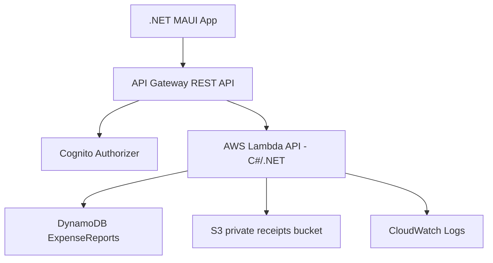
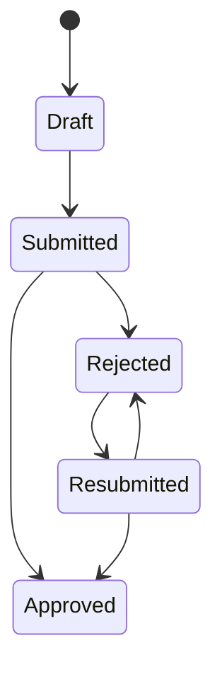

# Expense Tracker AWS


Expense Tracker AWS est un projet scolaire de gestion de notes de frais, realise avec un client .NET MAUI et un backend AWS serverless.

Le projet simule une application interne d'entreprise : un employe cree et soumet ses notes de frais, un Finance Manager les approuve ou les rejette, et les justificatifs restent prives dans S3 via URLs pre-signees.

Release : `v1.0.1`

## Sommaire

- [Fonctionnalites](#fonctionnalites)
- [Architecture](#architecture)
- [Workflow metier](#workflow-metier)
- [Stack technique](#stack-technique)
- [Structure du repository](#structure-du-repository)
- [Quick Start](#quick-start)
- [Deploiement AWS](#deploiement-aws)
- [Endpoints API](#endpoints-api)
- [Application Preview](#application-preview)
- [Key Technical Decisions](#key-technical-decisions)
- [Security](#security)
- [Lessons Learned](#lessons-learned)
- [Future Improvements](#future-improvements)
- [Documentation](#documentation)

## Fonctionnalites

- Connexion Cognito depuis le client MAUI.
- Roles `Employee` et `FinanceManager`.
- Creation de notes de frais en `Draft`.
- Liste et detail des notes de l'employe connecte.
- Soumission et resoumission : `Draft -> Submitted`, `Rejected -> Resubmitted`.
- File Finance pour les notes `Submitted` et `Resubmitted`.
- Approbation ou rejet avec justification obligatoire.
- URLs pre-signees S3 pour les justificatifs.
- Design system MAUI sobre : cartes, boutons et statuts lisibles.
- Tests backend sur domaine, routage, handlers, Cognito, DynamoDB et S3.

## Architecture



Le backend utilise une Lambda API unique avec routage interne. Ce choix simplifie le deploiement du MVP tout en gardant une separation claire entre handlers API, domaine metier, infrastructure AWS et contrats REST.

## Workflow metier



Les transitions sont validees cote serveur. Le client MAUI declenche les actions, mais Lambda reste responsable des regles de workflow et du RBAC.

## Stack technique

| Couche | Technologie |
| --- | --- |
| Client | .NET MAUI |
| Backend | AWS Lambda C#/.NET |
| API | Amazon API Gateway REST API |
| Auth | Amazon Cognito User Pool et groupes |
| Base de donnees | Amazon DynamoDB avec `GSI1` et `GSI2` |
| Justificatifs | Amazon S3 prive avec URLs pre-signees |
| Infrastructure | AWS SAM / CloudFormation |
| Tests | xUnit |

## Structure du repository

```text
src/
  ExpenseTracker.sln
  backend/
    ExpenseTracker.Api/
    ExpenseTracker.Api.Tests/
  mobile/
    ExpenseTracker.Maui/
infra/
  cloudformation/template.yaml
  scripts/deploy.ps1
  scripts/seed-users.ps1
  scripts/invoke-samples.ps1
  samples/
docs/
  project-context.md
  final-documentation-audit.md
  report/report.md
  source/
_bmad-output/
  planning-artifacts/
```

## Quick Start

Prerequis :

- .NET 10 SDK avec workloads MAUI.
- PowerShell 7 recommande.
- AWS CLI configure pour le deploiement.
- AWS SAM CLI installe.

Build et tests :

```powershell
dotnet build src\ExpenseTracker.sln
dotnet test src\ExpenseTracker.sln
```

Build du client MAUI Windows :

```powershell
dotnet build src\mobile\ExpenseTracker.Maui\ExpenseTracker.Maui.csproj -f net10.0-windows10.0.19041.0
```

Lancement du client MAUI Windows :

```powershell
dotnet build src\mobile\ExpenseTracker.Maui\ExpenseTracker.Maui.csproj -t:Run -f net10.0-windows10.0.19041.0
```

## Deploiement AWS

Le template SAM/CloudFormation est disponible ici :

```text
infra/cloudformation/template.yaml
```

Deployer :

```powershell
.\infra\scripts\deploy.ps1 -Environment dev -Region eu-west-1
```

Creer les utilisateurs Cognito de demo :

```powershell
.\infra\scripts\seed-users.ps1 -UserPoolId <user-pool-id> -Region eu-west-1
```

Lancer le smoke test API live :

```powershell
.\infra\scripts\invoke-samples.ps1 `
  -ApiUrl <api-url> `
  -UserPoolClientId <client-id> `
  -Region eu-west-1
```

La configuration du client MAUI est dans :

```text
src/mobile/ExpenseTracker.Maui/Services/AppConfig.cs
```

`ApiBaseUrl` et `CognitoClientId` sont des valeurs de configuration propres a l'environnement. Ce ne sont pas des secrets AWS, mais elles doivent correspondre a la stack deployee.

## Endpoints API

| Methode | Route | Role |
| --- | --- | --- |
| `GET` | `/me` | Authenticated |
| `POST` | `/expenses` | Employee |
| `GET` | `/expenses` | Employee |
| `GET` | `/expenses/{expenseId}` | Owner ou Finance |
| `PUT` | `/expenses/{expenseId}` | Owner |
| `POST` | `/expenses/{expenseId}/submit` | Owner |
| `POST` | `/expenses/{expenseId}/receipt-url` | Owner ou Finance selon operation |
| `GET` | `/finance/queue` | Finance Manager |
| `POST` | `/finance/expenses/{expenseId}/review` | Finance Manager |

## Application Preview

Le client MAUI couvre le parcours de demo complet :

- `LoginPage` : connexion email/password Cognito.
- `EmployeeExpensesPage` : liste employe, refresh, creation et detail.
- `CreateExpensePage` : montant, devise, categorie, description et date.
- `ExpenseDetailPage` : statut, informations de revue, justificatif, soumission et URL d'upload.
- `FinanceQueuePage` : file Finance, approve/reject.

Les captures ne sont pas versionnees pour l'instant. Pour une publication portfolio, ajouter les captures finales Windows dans `docs/images/` puis les referencer ici.

## Key Technical Decisions

- **Lambda API unique** : deploiement plus simple et moins de ressources a expliquer pour le MVP.
- **Domaine teste separe des handlers** : les transitions et le RBAC restent testables sans AWS.
- **Deux GSIs DynamoDB** : `GSI1` pour les listes Employee, `GSI2` pour la file Finance.
- **Validation serveur du workflow** : l'IHM ne decide jamais seule si une transition est autorisee.
- **Justificatifs S3 prives** : acces uniquement via URLs pre-signees courtes.
- **UI MAUI native** : pas de toolkit externe, donc moins de dependances et une demo plus simple.

## Security

- Aucun secret AWS ne doit etre versionne.
- API Gateway valide les JWT Cognito avant Lambda.
- Lambda reconstruit le contexte utilisateur depuis les claims Cognito.
- Le RBAC est applique cote serveur.
- Un Employee ne peut acceder qu'a ses propres notes.
- Un Finance Manager traite la file Finance sans modifier les champs metier.
- Les justificatifs S3 restent prives et passent par URLs pre-signees.
- Les tokens, mots de passe reels et URLs pre-signees completes ne doivent pas apparaitre dans les captures ou rapports.

## Lessons Learned

- Les access patterns DynamoDB doivent etre fixes avant d'ecrire le repository.
- Une machine d'etats dans le domaine rend les transitions invalides faciles a tester.
- Une Lambda unique reste maintenable si le routage, les handlers, le domaine et l'infrastructure restent separes.
- Le styling MAUI Shell sur Windows demande des choix de contraste explicites pour la navigation.
- Les scripts de demo sont utiles pour prouver le backend independamment de l'IHM.

## Future Improvements

- Pipeline CI/CD.
- Tests UI MAUI automatises.
- Historique d'audit detaille.
- Notifications email.
- OCR des justificatifs.
- Export comptable.
- Approbation multi-niveaux ou par seuil.

## Limites connues

- Pas de pipeline CI/CD de production.
- Audit minimal : statut, date de revue, reviewer et motif de rejet.
- Pas d'OCR, d'export comptable ou de notifications.
- Configuration MAUI dans `AppConfig.cs` pour simplifier la demo.

## Documentation

- [Contexte projet](docs/project-context.md)
- [Rapport final](docs/report/report.md)
- [Audit documentaire](docs/final-documentation-audit.md)
- [Artefacts BMAD](./_bmad-output/planning-artifacts/index.md)
