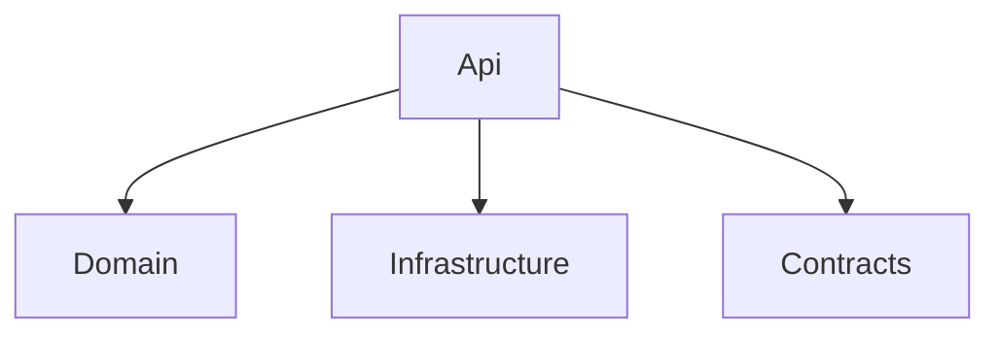

# Structure de repository

Le repository final separe clairement le client MAUI, le backend Lambda, l'infrastructure AWS, les samples et la documentation.

## Vue d'ensemble

```text
expense-tracker-aws/
  README.md
  docs/
    project-context.md
    final-documentation-audit.md
    report/
      report.md
    source/
      Project_ExpenseTracker_5ENTAPP.pdf
  src/
    ExpenseTracker.sln
    backend/
      ExpenseTracker.Api/
      ExpenseTracker.Api.Tests/
    mobile/
      ExpenseTracker.Maui/
  infra/
    cloudformation/
      template.yaml
      parameters.example.json
    scripts/
      deploy.ps1
      seed-users.ps1
      invoke-samples.ps1
    samples/
      create-expense.json
      submit-expense.json
      review-expense.json
      receipt-url.json
  _bmad-output/
    planning-artifacts/
```

## Backend

```text
src/backend/ExpenseTracker.Api/
  Api/
    LambdaEntryPoint.cs
    RequestRouter.cs
    RouteMatch.cs
    ApiResponse.cs
    ApiJsonOptions.cs
    Handlers/
      MeHandler.cs
      ExpenseHandlers.cs
      FinanceHandlers.cs
      ReceiptHandlers.cs
  Contracts/
    CreateExpenseRequest.cs
    UpdateExpenseRequest.cs
    ReviewExpenseRequest.cs
    ReceiptUrlRequest.cs
    ExpenseResponse.cs
    MeResponse.cs
    PresignedUrlResponse.cs
  Domain/
    ExpenseReport.cs
    ExpenseStatus.cs
    ExpenseStateMachine.cs
    ExpensePolicy.cs
    ReviewDecision.cs
    DomainError.cs
  Infrastructure/
    Auth/
      CognitoUserContext.cs
      UserContextFactory.cs
    DynamoDb/
      IExpenseRepository.cs
      InMemoryExpenseRepository.cs
      DynamoExpenseRepository.cs
      DynamoExpenseMapper.cs
      DynamoExpenseItem.cs
    S3/
      IReceiptService.cs
      LocalReceiptService.cs
      S3ReceiptService.cs
      ReceiptKeyBuilder.cs
    Clock.cs
```

Responsabilites :

- `Api/` convertit les requetes API Gateway en appels applicatifs.
- `Domain/` porte les regles de workflow, RBAC et ownership.
- `Infrastructure/` isole Cognito, DynamoDB et S3.
- `Contracts/` stabilise les payloads JSON.



## Tests backend

```text
src/backend/ExpenseTracker.Api.Tests/
  Api/
  Domain/
  Infrastructure/
```

Les tests couvrent le routeur, les handlers, la machine d'etats, les politiques RBAC, Cognito, DynamoDB et S3.

## Client MAUI

```text
src/mobile/ExpenseTracker.Maui/
  App.xaml
  AppShell.xaml
  MauiProgram.cs
  Models/
    ExpenseReportDto.cs
    ExpenseStatus.cs
    MeDto.cs
    PresignedUrlDto.cs
  Services/
    AppConfig.cs
    AuthService.cs
    ExpenseApiClient.cs
    SecureTokenStore.cs
  Views/
    LoginPage.xaml
    EmployeeExpensesPage.xaml
    CreateExpensePage.xaml
    ExpenseDetailPage.xaml
    FinanceQueuePage.xaml
  Resources/
    Styles/
      Colors.xaml
      Styles.xaml
```

La navigation est basee sur `AppShell`. Les pages utilisent des services injectes et une UI MAUI native, sans framework UI externe.

## Infrastructure

Le template `infra/cloudformation/template.yaml` decrit :

- Cognito User Pool, App Client et groupes `Employee` / `FinanceManager` ;
- API Gateway REST avec Cognito Authorizer ;
- Lambda API C#/.NET ;
- table DynamoDB `ExpenseReports-${Environment}` avec `GSI1` et `GSI2` ;
- bucket S3 prive pour les justificatifs ;
- role IAM Lambda limite a DynamoDB, S3 et CloudWatch.

Scripts :

- `deploy.ps1` : build et deploy SAM.
- `seed-users.ps1` : creation de comptes de demo Cognito.
- `invoke-samples.ps1` : smoke test de l'API live.

## Elements volontairement absents

- Pipeline CI/CD complet.
- Plusieurs Lambdas par domaine.
- ViewModels dedies : la version finale reste simple avec code-behind MAUI.
- Tests automatises UI MAUI.
- Historique d'audit detaille sous forme d'entites DynamoDB separees.
