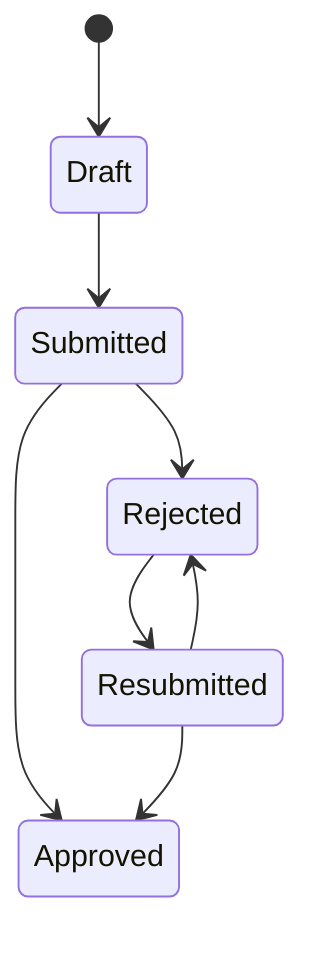

# Expense Tracker AWS - Contexte projet final

Projet scolaire AWS 5ENTAPP / E5WMD.

Objectif : developper une application serverless de gestion de notes de frais avec client .NET MAUI, backend Lambda C#/.NET et services AWS manages.

Etat final : version `v1.0.1`.

## Stack realisee

- .NET MAUI pour l'IHM mobile/desktop.
- Amazon Cognito pour l'authentification et les roles.
- API Gateway comme point d'entree REST.
- AWS Lambda en C#/.NET pour la logique metier.
- DynamoDB pour les notes de frais.
- S3 pour les justificatifs via URLs pre-signees.
- IAM pour les permissions.
- CloudWatch pour les logs.
- AWS SAM / CloudFormation pour l'infrastructure.

## Roles

- `Employee` : cree, consulte, soumet et resoumet ses notes de frais.
- `FinanceManager` : consulte la file Finance, approuve ou rejette avec justification.

## Workflow

Regles principales :

- Les transitions d'etat sont validees cote serveur dans Lambda.
- L'acces aux donnees est filtre selon le role Cognito et l'identite utilisateur.
- Aucun justificatif S3 n'est public.
- Le client MAUI ne contient aucune cle AWS.
- Le repository reste publiable sans secrets reels.

## Client MAUI

Pages principales :

- `LoginPage` : connexion email/password Cognito.
- `EmployeeExpensesPage` : liste des notes de l'employe, refresh, acces creation/detail.
- `CreateExpensePage` : creation d'une note.
- `ExpenseDetailPage` : detail, soumission, upload de justificatif selon statut.
- `FinanceQueuePage` : file Finance, approve/reject.

La couche visuelle utilise un design system MAUI natif et sobre : couleurs corporate, cartes, boutons, statuts lisibles et navigation Shell coherente.

## Backend

Le backend est une Lambda API unique avec routage interne :

- `Api/` : entree Lambda, router, handlers HTTP.
- `Domain/` : statuts, machine d'etats, politiques RBAC.
- `Infrastructure/` : Cognito, DynamoDB, S3, horloge.
- `Contracts/` : DTOs REST.

Les tests backend couvrent notamment :

- machine d'etats ;
- RBAC et ownership ;
- routing API ;
- handlers Employee, Finance et receipts ;
- mapping Cognito ;
- requetes DynamoDB et GSIs ;
- generation d'URLs pre-signees S3.

## Livrables

- Source code MAUI et Lambda.
- Template SAM/CloudFormation.
- Scripts de deploiement, seed users et smoke test.
- Samples JSON.
- README a jour.
- Rapport final Markdown dans `docs/report/report.md`.
- Artefacts BMAD dans `_bmad-output/planning-artifacts/`.

## Limites assumees

- Pas de CI/CD complet.
- Pas de reporting comptable avance.
- Pas d'OCR de justificatif.
- Pas de notifications email.
- Historique d'audit volontairement minimal pour rester dans le scope scolaire.
