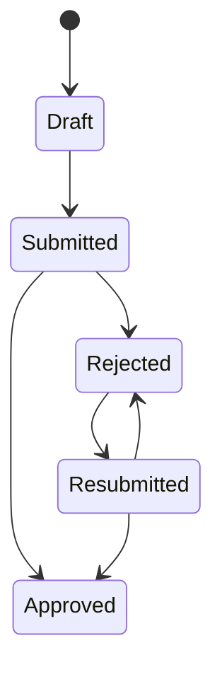
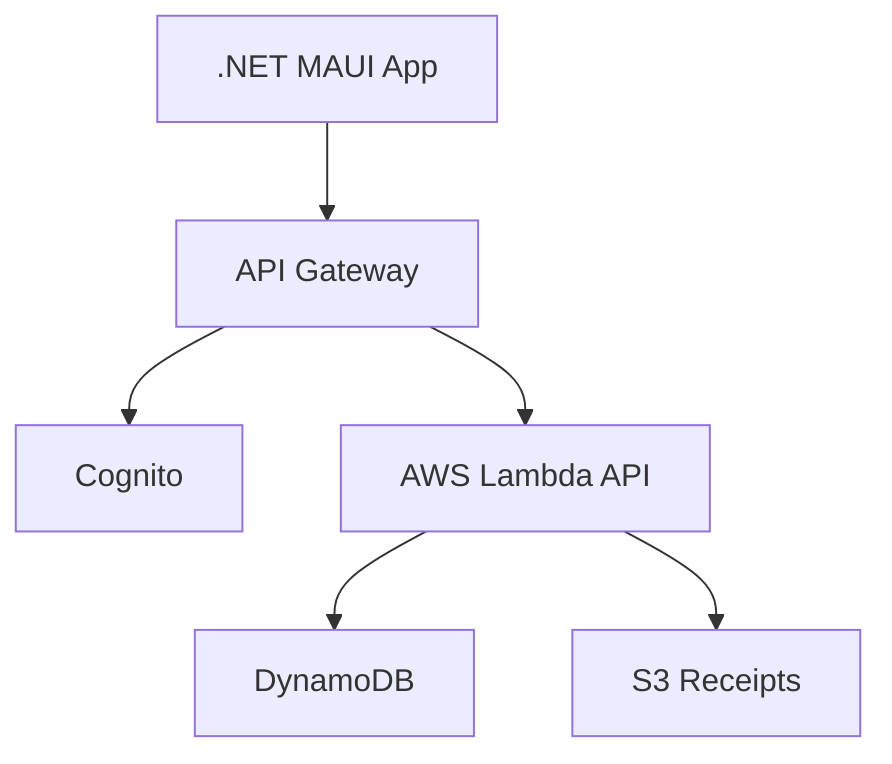

# Rapport final - Expense Tracker AWS

Version : `v1.0.1`

## 1. Contexte et objectif

Expense Tracker AWS est une application scolaire de gestion de notes de frais. Elle repond a un probleme courant en entreprise : les demandes de remboursement circulent souvent par email, tableurs ou pieces jointes dispersees, ce qui complique le suivi, l'audit et la validation.

L'objectif du projet est de fournir un MVP complet avec deux roles :

- `Employee` : cree, consulte, soumet et resoumet ses notes de frais ;
- `FinanceManager` : consulte les notes en attente, approuve ou rejette avec justification.

Le workflow principal est controle cote serveur :



## 2. Architecture AWS

L'application utilise une architecture serverless simple et defendable pour un projet scolaire.



Services utilises :

| Service | Role |
| --- | --- |
| .NET MAUI | Interface mobile/desktop. |
| Cognito | Authentification et groupes `Employee` / `FinanceManager`. |
| API Gateway | Point d'entree REST securise par Cognito Authorizer. |
| Lambda C#/.NET | Logique metier, RBAC, machine d'etats, acces AWS. |
| DynamoDB | Stockage des notes de frais. |
| S3 | Stockage prive des justificatifs. |
| IAM | Permissions minimales Lambda vers DynamoDB, S3 et logs. |
| CloudWatch | Logs d'execution. |

Le backend est une Lambda API unique avec routage interne. Ce choix reduit la complexite de deploiement tout en gardant une structure de code propre : `Api`, `Domain`, `Infrastructure`, `Contracts`.

## 3. Modele DynamoDB

La table principale est `ExpenseReports-${Environment}`.

Cle primaire :

- `PK = EXPENSE#{expenseId}`
- `SK = METADATA`

Attributs importants :

- `employeeId`, `employeeEmail`
- `amount`, `currency`, `category`, `description`, `expenseDate`
- `status`
- `receiptKey`
- `createdAt`, `updatedAt`, `submittedAt`, `reviewedAt`
- `reviewedBy`, `rejectionReason`

Indexes :

| Index | Usage |
| --- | --- |
| `GSI1` | Lister les notes d'un Employee via `EMPLOYEE#{employeeId}`. |
| `GSI2` | Alimenter la file Finance via `STATUS#Submitted` et `STATUS#Resubmitted`. |

Le modele evite les scans globaux. Les notes `Draft`, `Rejected` et `Approved` ne sont pas dans la file Finance, donc elles ne sont pas indexees dans `GSI2`.

## 4. Implementation et securite

Endpoints principaux :

| Methode | Route | Role |
| --- | --- | --- |
| `GET` | `/me` | Authenticated |
| `POST` | `/expenses` | Employee |
| `GET` | `/expenses` | Employee |
| `GET` | `/expenses/{expenseId}` | Owner ou Finance |
| `PUT` | `/expenses/{expenseId}` | Owner |
| `POST` | `/expenses/{expenseId}/submit` | Owner |
| `POST` | `/expenses/{expenseId}/receipt-url` | Owner ou Finance selon operation |
| `GET` | `/finance/queue` | Finance Manager |
| `POST` | `/finance/expenses/{expenseId}/review` | Finance Manager |

Securite :

- API Gateway valide les JWT Cognito.
- Lambda reconstruit le contexte utilisateur depuis les claims.
- Le RBAC est applique cote serveur.
- Un Employee ne peut acceder qu'a ses propres notes.
- Un Finance Manager peut traiter la file Finance mais ne modifie pas le contenu metier d'une note.
- Les justificatifs S3 ne sont pas publics et passent par URLs pre-signees.
- Les transitions invalides sont refusees par la machine d'etats et les conditions DynamoDB.

## 5. Client MAUI

Pages principales :

- `LoginPage` : connexion email/password.
- `EmployeeExpensesPage` : liste et refresh des notes de l'employe.
- `CreateExpensePage` : creation d'une note.
- `ExpenseDetailPage` : detail, soumission et justificatif.
- `FinanceQueuePage` : file Finance, approbation et rejet.

L'interface a ete harmonisee avec un design system MAUI natif : palette corporate, fond clair, cartes lisibles, boutons contrastes, badges de statut et navigation Shell coherente.

## 6. Tests et validation

Commande de validation :

```powershell
dotnet test src\ExpenseTracker.sln
```

Les tests backend couvrent :

- machine d'etats ;
- RBAC et ownership ;
- routeur REST ;
- handlers Employee et Finance ;
- endpoint receipts ;
- mapping Cognito ;
- requetes DynamoDB ;
- URLs pre-signees S3.

La demonstration orale doit montrer le parcours complet Employee puis Finance, ainsi qu'un cas refuse cote serveur pour prouver que la securite ne depend pas uniquement de l'IHM.

## 7. Limites et ameliorations futures

Limites assumees :

- pas de CI/CD complet ;
- historique d'audit minimal ;
- pas de tests UI automatises MAUI ;
- configuration client simplifiee dans `AppConfig.cs` pour la demo.

Ameliorations possibles :

- notifications email ;
- OCR des justificatifs ;
- export comptable ;
- approbation multi-niveaux ;
- pipeline CI/CD ;
- table d'evenements d'audit detaillee.

## Conclusion

Le projet repond au sujet scolaire avec une application .NET MAUI connectee a une architecture AWS serverless complete. Les points essentiels sont couverts : authentification, roles, workflow serveur, DynamoDB avec GSIs, S3 prive avec URLs pre-signees, scripts de deploiement et tests backend.
